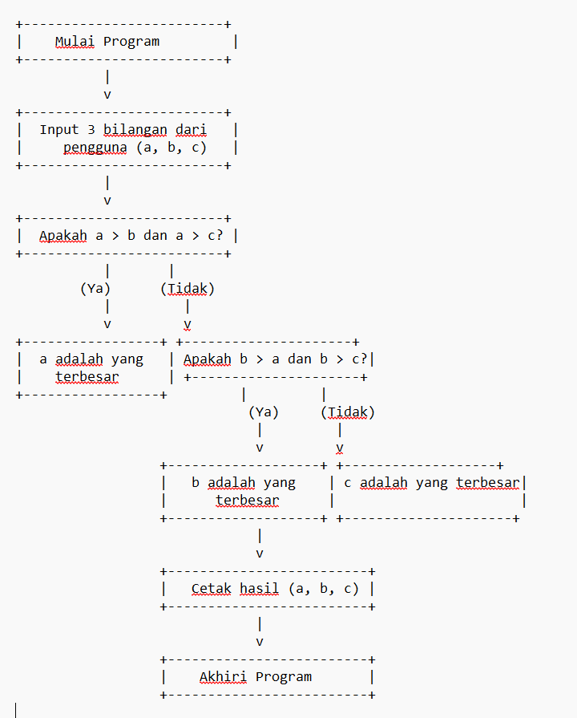
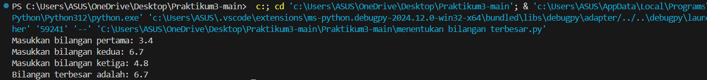

# Praktikum3
# Program Python untuk Menentukan Bilangan Terbesar

Program ini ditulis dalam bahasa Python dan berfungsi untuk menentukan bilangan terbesar dari tiga bilangan yang dimasukkan oleh pengguna. Program akan meminta pengguna untuk memasukkan tiga bilangan, kemudian akan membandingkan ketiga bilangan tersebut dan menampilkan bilangan terbesar.

## Cara Kerja Program

1. Program menerima tiga input bilangan dari pengguna.
2. Fungsi `bilangan_terbesar` membandingkan ketiga bilangan tersebut dengan menggunakan pernyataan `if-elif-else`.
   - Jika bilangan pertama lebih besar dari bilangan kedua dan ketiga, maka bilangan pertama dikembalikan sebagai hasil.
   - Jika bilangan kedua lebih besar dari bilangan pertama dan ketiga, maka bilangan kedua dikembalikan sebagai hasil.
   - Jika kedua kondisi di atas tidak terpenuhi, maka bilangan ketiga dianggap sebagai yang terbesar.
3. Hasil dari perbandingan akan ditampilkan ke layar sebagai output.
   
## Penjelasan Program

1. Input: Program meminta tiga input bilangan dari pengguna.
2. Proses:
  - Program membandingkan bilangan-bilangan menggunakan pernyataan kondisional (if, elif, else).
  - Pertama, dicek apakah bilangan pertama (a) lebih besar dari kedua bilangan lainnya.
  - Jika tidak, dilanjutkan dengan pengecekan bilangan kedua (b).
  - Jika keduanya tidak memenuhi kondisi, maka bilangan ketiga (c) dianggap sebagai yang terbesar.
3. Output: Setelah menentukan bilangan terbesar, program mencetak hasilnya ke layar.
4. Selesai: Program selesai setelah menampilkan bilangan terbesar

## Kebutuhan

- Python 3.x

## Cara Menjalankan Program

1. Pastikan Python sudah terpasang di komputer Anda.
2. Simpan script program dalam file Python, misalnya `bilangan_terbesar.py`.
3. Jalankan program dengan perintah berikut di terminal atau command prompt:

## Flowchart

## Screenshot Hasil Eksekusi

